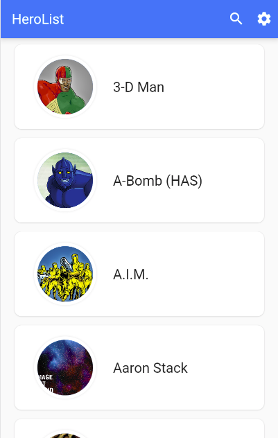

# marvel-app-skyhook

## 📸 ScreenShots
| 1 | 2 |
|-------|-------|
|||

|   3  |
|-------|
|


## ✨ Requirements
* Any Operating System (ie. MacOS X, Linux, Windows)
* Any IDE with Flutter SDK installed (ie. IntelliJ, Android Studio, VSCode etc)
* A little knowledge of Dart and Flutter

## 🤓 Author(s)
**soul-oge**

## Getting Started

# Clone this repository
```bash
$ git clone https://github.com/soul-oge/marvel-app-skyhook.git
```
# Go into the repository
```bash
$ cd maverl_app/
```
# Install dependencies
```bash
$ flutter pub get
```
# Run the app
```bash
$ flutter run
```
